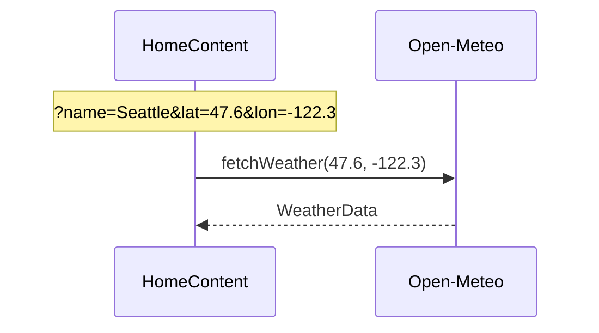
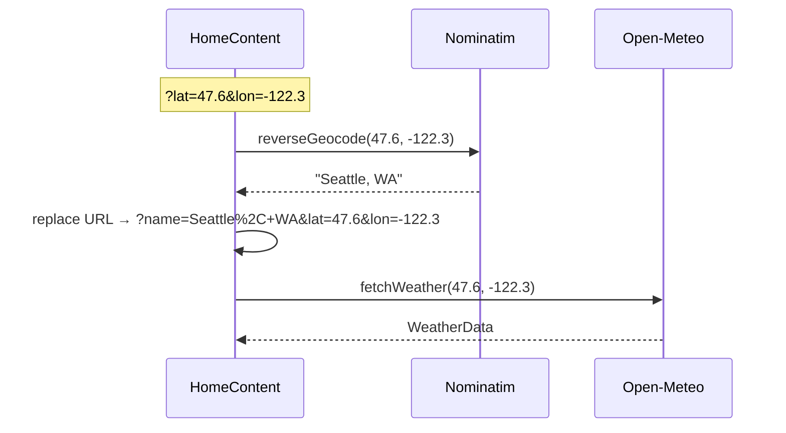
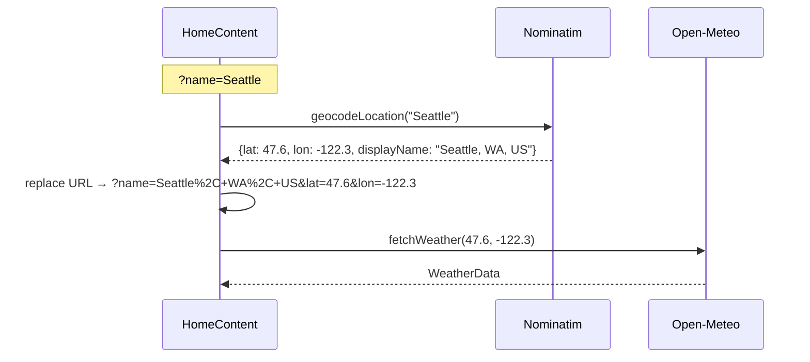
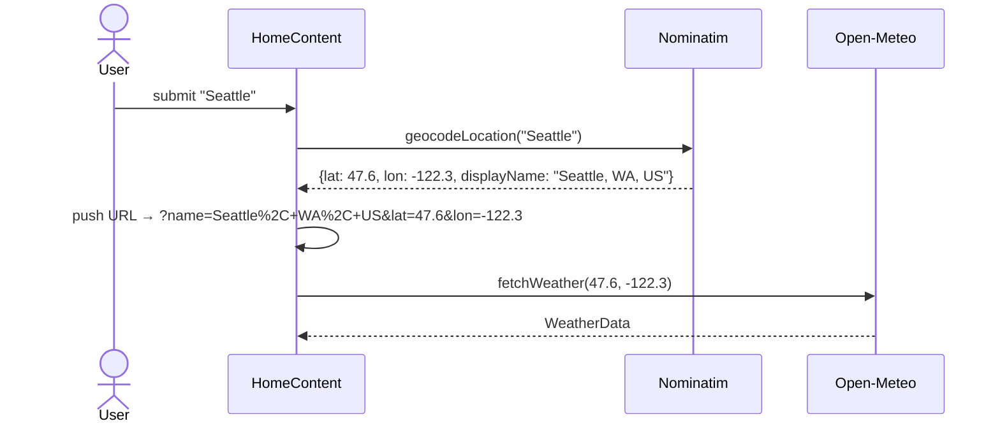
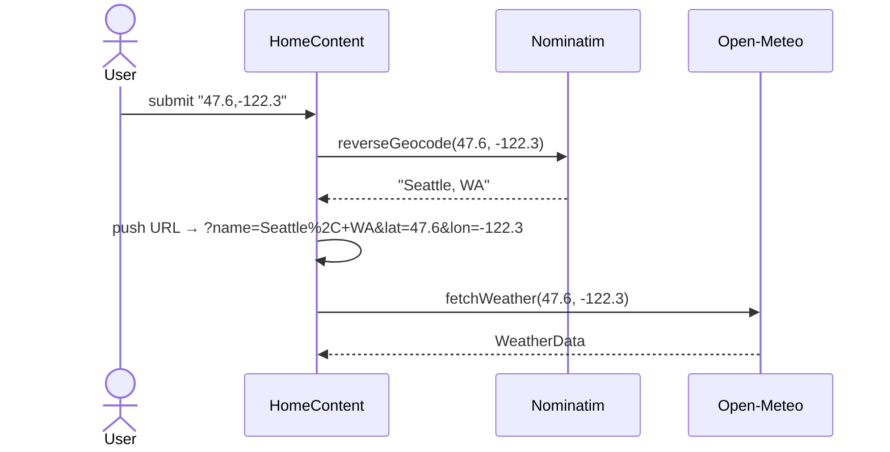
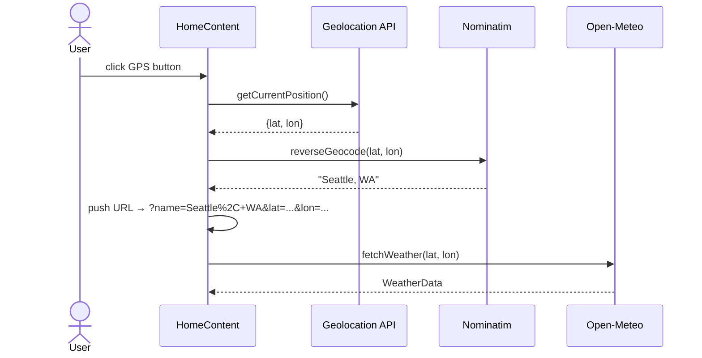
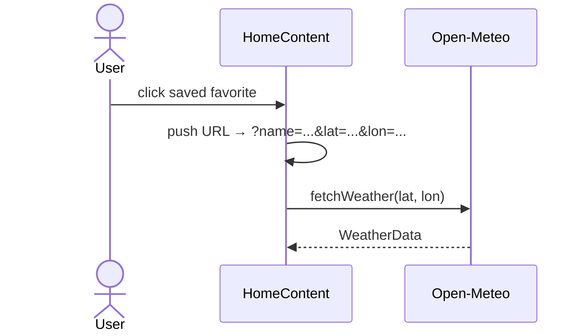

# Metal Weather

A Next.js site that fetches the current weather for a location and plays a
heavy metal song matched to the conditions (e.g. _Raining Blood_ by Slayer for
rain).

## Current State

### What the App Does

1. User searches for a city by name via the modal, or uses the GPS button in
   `LocationBar` to detect their location via the browser Geolocation API. The
   active location is reflected in the URL as
   `?name=Seattle&lat=47.6061&lon=-122.3328`.
2. Forward and reverse geocoding (city name / US zip code → lat/lon and GPS
   coordinates → display name) both use Nominatim (OpenStreetMap).
3. Weather is fetched from Open-Meteo Forecast. The WMO weather code is mapped
   to one of seven `WeatherStatus` values; a matching song is selected from the
   JSON catalog.
4. The matched song plays automatically (HTML5 `<audio>` with fade in/out
   cropping). The user can pause, seek, and resume.
5. On any error (geocode failure, network error, unrecognized code) an error
   card is shown with a fallback song.
6. The user can bookmark the current location via the star icon in `LocationBar`.
   Favorites are persisted to `localStorage` and listed in the search modal for
   one-click access. The bookmark icon reflects the saved state and toggles
   add/remove. Each favorite can be renamed via the ✏️ button next to its name,
   which opens a modal pre-filled with the current name.

### Technology

- **Framework**: Next.js 16 (App Router, `output: "export"` for fully-static build)
- **Language**: TypeScript / React 19
- **Styling**: Tailwind CSS v4
- **Testing**: Vitest + Testing Library

### Key Data Types

**`Song`** (`src/lib/types.ts`):

| Field       | Type     | Description                         |
| ----------- | -------- | ----------------------------------- |
| `title`     | `string` | Song title                          |
| `artist`    | `string` | Performing artist or band           |
| `audioFile` | `string` | Path to MP3 in `public/`            |
| `youtubeId` | `string` | YouTube video ID                    |
| `startTime` | `number` | Clip start (seconds)                |
| `endTime`   | `number` | Clip end (seconds)                  |
| `fadeIn`    | `number` | Fade-in duration (seconds)          |
| `fadeOut`   | `number` | Fade-out duration (seconds)         |
| `coverArt?` | `string` | Path to cover art JPEG in `public/` |

**`WeatherData`** (`src/lib/types.ts`) — current conditions plus today's
high/low, all numeric fields provided in both metric and imperial units.
Includes an `hourly` block with the next 12 hours of temperatures
and `WeatherStatus` values pre-derived from WMO codes.

**`Location`** (`src/lib/types.ts`) — a resolved location with `displayName`,
`lat`, and `lon`. Used for saved favorites (persisted as a JSON array under the
`"favorites"` `localStorage` key) and as the canonical location type throughout
the app.

### Components

| Component             | Role                                                                                                 |
| --------------------- | ---------------------------------------------------------------------------------------------------- |
| `AppBar`              | Top navigation bar with settings (units toggle, dark/light theme)                                    |
| `LocationBar`         | Persistent bar showing current location; GPS, open-modal, and bookmark buttons                       |
| `LocationModal`       | Full-screen overlay with `LocationSearch` form and saved favorites list; opens `RenameFavoriteModal` |
| `RenameFavoriteModal` | Centered modal for editing a favorite's display name                                                 |
| `LocationSearch`      | Text input + Go button                                                                               |
| `WeatherCard`         | Current temperature, condition emoji, hi/lo                                                          |
| `SongCard`            | Cover art, song title/artist, `MusicPlayer` controls                                                 |
| `HourlyForecast`      | Horizontally scrolling 12-hour strip (temp + emoji + hour)                                           |
| `ErrorCard`           | Error message + fallback song                                                                        |
| `MusicPlayer`         | HTML5 audio player with play/pause, seek, and time display                                           |
| `Spinner`             | Centered animated loading indicator shown during weather fetches                                     |
| `HomeContent`         | Orchestrates all search state and renders the above cards                                            |
| `SettingsContext`     | React context for unit system (metric / imperial) and theme                                          |
| `FavoritesContext`    | React context for saved locations, backed by `localStorage`                                          |

### External APIs (Free, No API Key)

| API                       | Purpose                                                               |
| ------------------------- | --------------------------------------------------------------------- |
| Nominatim (OpenStreetMap) | City name / US zip code → lat/lon/displayName; lat/lon → display name |
| Open-Meteo Forecast       | lat/lon → current weather + hourly 12-hour forecast                   |

### URL Parameters

The active location is stored in three query parameters. `lat` and `lon` are
canonical — they drive the weather fetch directly. `name` is the human-readable
display name shown in `LocationBar`.

Every user action (text search, coordinate input, GPS, select favorite) writes
all three parameters to the URL so the result is always bookmarkable and
reloadable. If only some parameters are present on load, the missing ones are
resolved and the URL is updated before fetching. With no parameters, the search
modal opens.

#### URL Load Sequences

**All three parameters present** — weather is fetched directly, no geocoding:

**Coordinates only, no `name`** — reverse geocoded first, URL updated with resolved name:

**Name only, no coordinates** — geocoded first, URL updated with resolved coordinates:

### API Call Flow by Input Type

| User Action                           | API Calls                                              |
| ------------------------------------- | ------------------------------------------------------ |
| Type city name or zip code            | Nominatim → Open-Meteo                                 |
| Type coordinates (e.g. `47.6,-122.3`) | Nominatim (reverse) → Open-Meteo                       |
| GPS button                            | Browser Geolocation → Nominatim (reverse) → Open-Meteo |
| Select saved favorite                 | Open-Meteo only                                        |

#### User Action Sequences

**City name or zip code:**

**Coordinate input (e.g. `47.6,-122.3`):**

**GPS button:**

**Select saved favorite:**

### Song Catalog

Defined in `src/data/songs.json`. One song per `WeatherStatus` plus one error
fallback. Cover art JPEGs are stored alongside MP3s in `public/assets/`.
